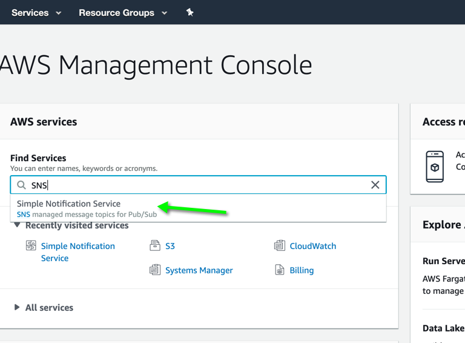
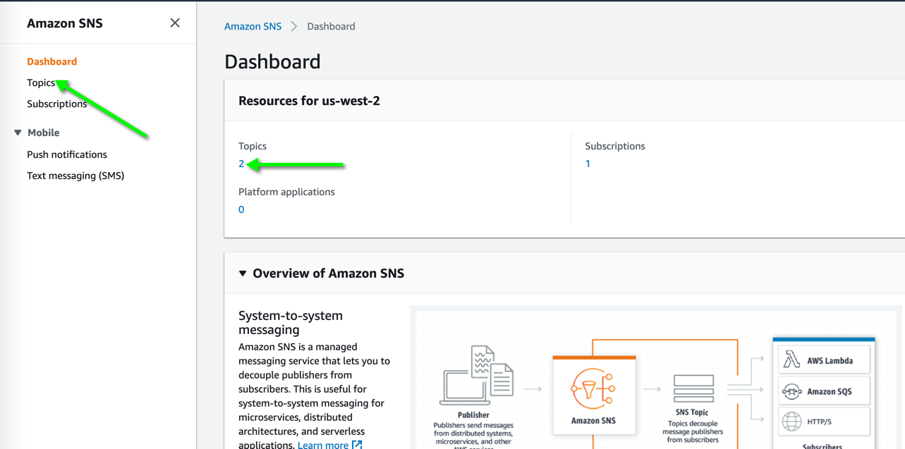
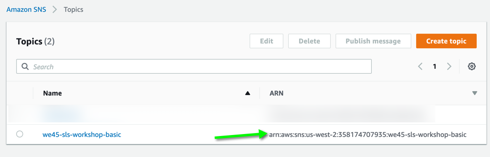

# Basics - Serverless Events

>This lesson is a basic lesson in triggering serverless functions for Non-API Gateway Events. 
In this lesson, we will trigger a Serverless Function whenever messages are published over a particular SNS (Simple Notification Service) Topic (Channel)

**Note:** If you have not setup your aws cli follow [AWS-CLI-Configuration](aws-configure/README.md) under the `Setup` section*

* Step 1: In your image, navigate over to `/root/labs/Serverless-Workshop/Basic-Event`

```commandline
cd /root/labs/Serverless-Workshop/Basic-Event
```

* Step 2: Run `sls plugin install -n serverless-python-requirements`

```commandline
sls plugin install -n serverless-python-requirements
```

* Wait for instructor to explain the contents of the lab

* Step 3: Let's look at the contents of the `serverless.yml` [here](https://github.com/we45/Serverless-Workshop/blob/master/Basic-Event/serverless.yml)

* Step 4: Deploy the function with the command `sls deploy`

```commandline
sls deploy
```

* Wait for the function to deploy completely

* Step 5: Now access your AWS Console and look for Simple Notification Service or `SNS`



* Step 6: Click to go to SNS Main Page, which looks like this and click on topics to find the ARNS of all your current topics



* Step 7: Now Copy the Topic-ARN



* In your lab environment, in the CLI, enter the following command

* Step 8: You have to have configured AWS CLI by now*

```commandline
aws sns publish --region '<region>' --topic-arn "<Copied ARN>" --message "I am going to be pwning Serverless Functions soon!"

```
**Remember to substitute the `<Copied ARN>` with the ARN that you copied from the previous step and also replace the region**

* Step 9: Now, let's see whether the Serverless Function worked, by running the following command

```bash

sls logs --function sns-reactor
```
```commandline
START RequestId: 44478848-a777-45e0-a1cf-e11cd499071e Version: $LATEST
END RequestId: 44478848-a777-45e0-a1cf-e11cd499071e
REPORT RequestId: 44478848-a777-45e0-a1cf-e11cd499071e	Duration: 1.41 ms	Billed Duration: 100 ms 	Memory Size: 512 MB	Max Memory Used: 52 MB

START RequestId: 1066617f-4b0f-4683-b91b-ffbd81e40a86 Version: $LATEST
{'Records': TRUNCATED

```

### Teardown

* Step 10: In your image, navigate over to `/root/labs/Serverless-Workshop/Basic-Event`

```commandline
cd /root/labs/Serverless-Workshop/Basic-Event
```

* Step 11: Run `sls remove` to remove stack

```commandline
sls remove --force
```
