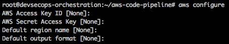
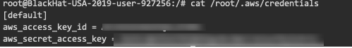
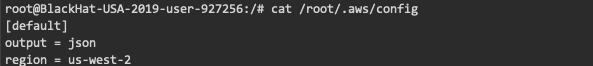

## AWS CLI Configuration
---
* Step 1: Go to browser

* Step 2: Signup/Signin to aws console

* Step 3: In the search bar type `IAM`

* Step 4: Click on `Users` on the sidebar

* Step 5: Click on add user, you will be redirected to a new page

* Step 6: Fill the user name you wish

* Step 7: In the `Access type` checkbox selection select `Programmatic access` and click `Next`

* Step 8: Now select `Attach existing policies directly` 

* Step 9: In the search bar enter `AdministratorAccess`

* Step 10: Now select the one which has a Policy name as `AdministratorAccess` and click `Next` and again click `Next`

* Step 11: Now click `Create User`

* Step 12: Now you can download the csv file that will have your `access-key` and `secret-key`

* Step 13: Open terminal

* Step 14: Initiate configuration

```commandline
aws configure
```

You will be prompted to enter you aws credentials



> **NOTE**: Ensure that the `Default region name` is `us-west-2`

* Step 15: Once you complete the configuration type

```commandline
cat /root/.aws/credentials
```
The output of the following command will look like



```commandline
cat /root/.aws/config
```
The output of the following command will look like



