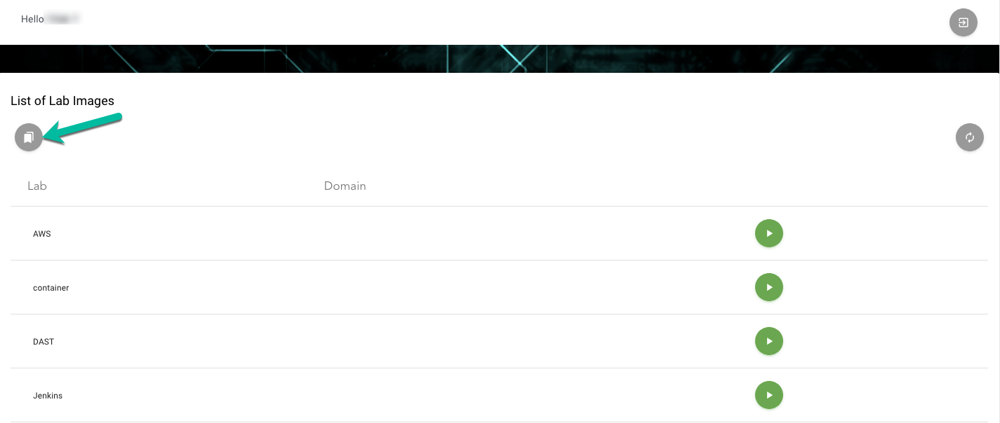
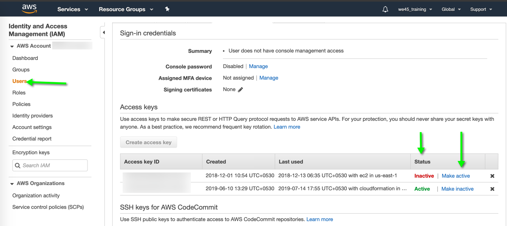

# FAQs - Frequently Asked Quetions

### How long is the Lab Environment available?
The lab environment is available through the length of the training. At the end of the training, the lab system is scrubbed with all data associated with the event. 

### How do I get access to the materials and code used for the training?
Throughout the training, you'll need access to code, presentations and links used in the training. There's a separate view in the lab system to access those

First, in the dashboard, you should click on this icon

Once you click on this icon, you'll get a table with all the necessary artefacts used in the training. 

### For the AWS class, I have entered my AWS Access Key and Secret in the server. How will I know it will be safe? 
* Each server is dedicated to the person using it only. There are no shared environments in our classes.
* Regarding AWS Access Key and Secret, we recommend that you make the specific AWS Access Key inactive/delete it. You can do this from your AWS Console. 

**Please feel free to do this as often as you need**

**If you do this, please remember to always reconfigure the server with `aws configure`**

* In addition, all the servers are scrubbed and deleted after the expiry time for the server and any data from the previous user is scrubbed from the server.