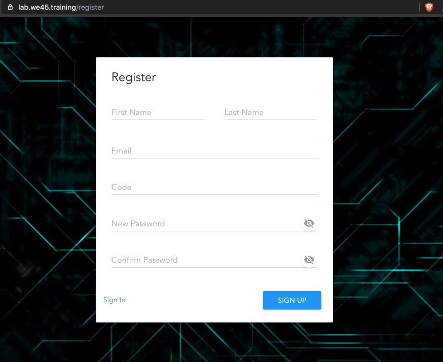
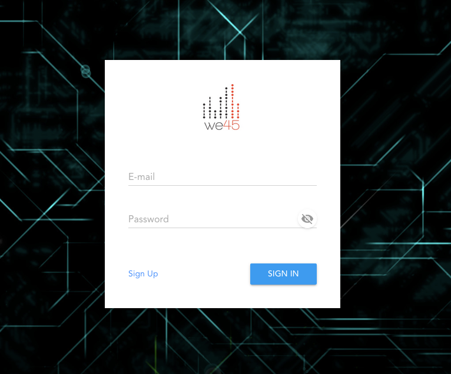
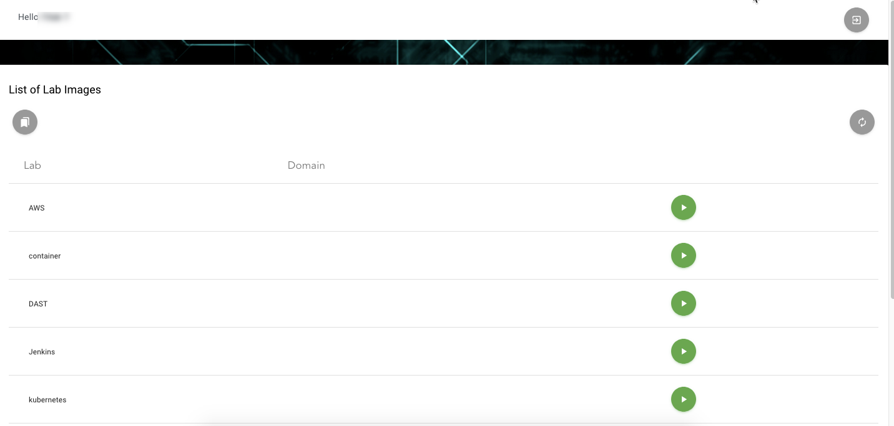
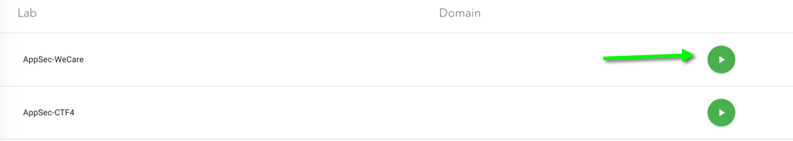
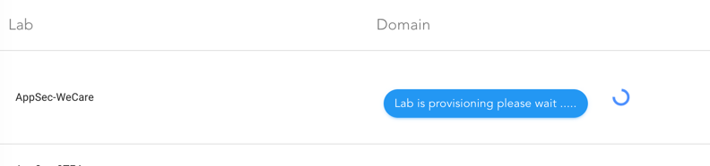
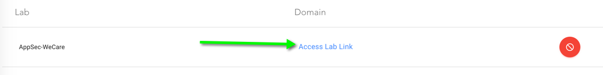
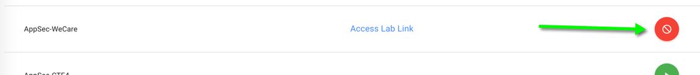
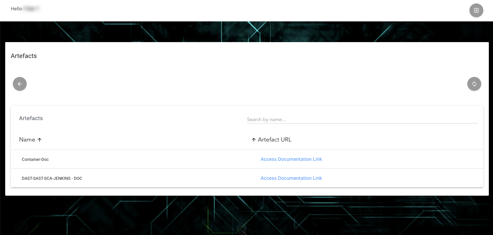

# Using the labs for this class

## Signing up for the Lab Management System

>You will be using a state-of-the-art lab management system for this class. This works as follows: 

### Hangouts Link: https://meet.google.com/xcn-gwqr-qip

* You will need to sign-up with a special code (given by your instructor) for the Lab [at this link](https://lab.we45.training)

``` Commandline
https://lab.we45.training
```

* Event Code

```commandline
dc27-sls-workshop-appsec-XtRHD
```

 


* Once you successfully sign up. You'll need to Sign in with the email and password you've provided.



 
>**Please do not forget the password you've used. We recommend you use a password manager**

* Once you login, you should see a screen like this


 

As you can see, you will a list of topics for which you can provision the lab servers. The Lab servers can be provisioned by clicking on the `Play` button on each row, in the right corner. 

 

Once you press play, you'll see a spinner that indicates that the server is being provisioned for you. You'll need to press play on the lab that the instructor mentions in the class.

 

Please wait for the server to be provisioned and do NOT click on the Refresh button during this process. It takes upto 5 minutes for the dedicated lab to be provisioned for you.

Once the lab is provisioned, you'll be able to access it by clicking on the lab link here

 

Once you click on the lab link, you'll have an additional browser tab open that will give you direct shell access to the server right from your browser.

Usually, your server expires after a particular time automatically. Howver, you can stop the server (destroying the lab environment) by clicking on the button indicated below

 

> Remember, all the servers that you provision are dedicated to you and for you, for the entire length of the training.

> The date and time indicate when the server will automatically shut-off. If that happens, don't worry. You can always re-provision the server as you provisioned it the first time. 

> You can concurrently provision only one server. Althought, you may have multiple servers running at the same time.


## Accessing the Material

* Throughout the training, you'll need access to code, presentations and links used in the training. There's a separate view in the lab system to access those

First, in the dashboard, you should click on this icon


Once you click on this icon, you'll get a table with all the necessary artefacts used in the training. 

>> Please feel free to download these materials before the training ends. You will not have access to the portal after the class ends, as all the material gets scrubbed from the lab system


